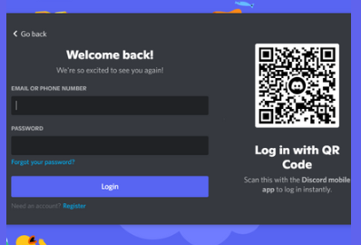

# Discord Channel

Discord is a free communications app that lets you share voice, video and text chat, similar to that of Whatsapp.  It is a platform where one can become part of the Rebase community and share ideas, queries, comments, feedback and interact with other members that are also invested in Rebase.

How to download Discord

Step 1:  Follow the steps set out below to set up your Discord App - Click this link to get started  [Discord Link](https://discord.com/)

.png>)

Step 2:  Choose to Add Account.

.png>)

Step 3: Press Register at the bottom of the page.

Step 4: Enter your email address, your username and password, date of birth, tick the box and press continue.

.png>)

Step 5: Click on the images that come up and continue.

.png>)

Step 6: It will ask to enter an Invite Link, copy and paste the following link into the bar [https://discord.gg/BrHnWBGX](https://discord.gg/BrHnWBGX) or click the link and accept the invite.

.png>)

Step 7: Nearly there!! You will need to verify your email address and accept the rules and then your done.

.png>)

Step 8: Tick the box that accepts the Rules and click Submit.

.png>)

You are now a member of DISCORD. Welcome.

.png>)

